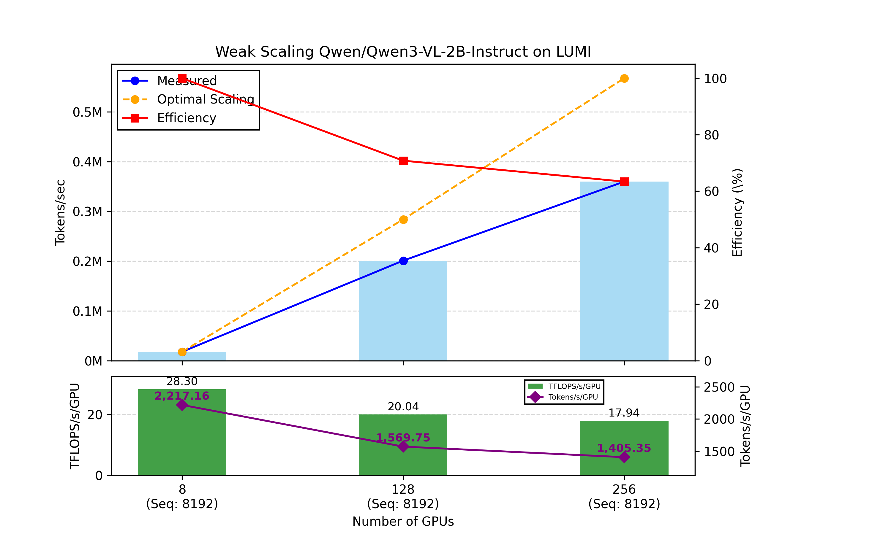
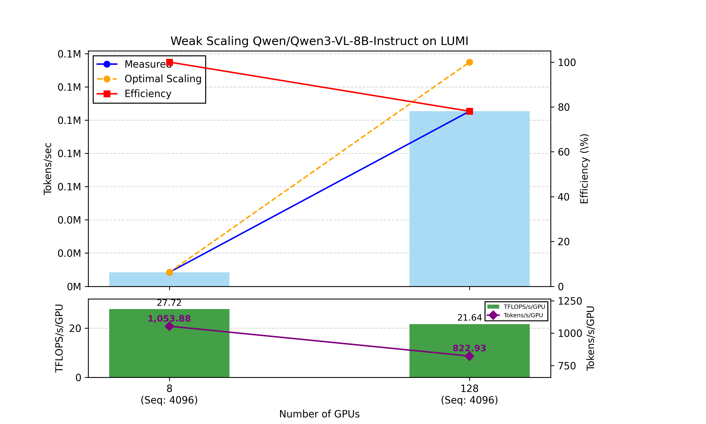
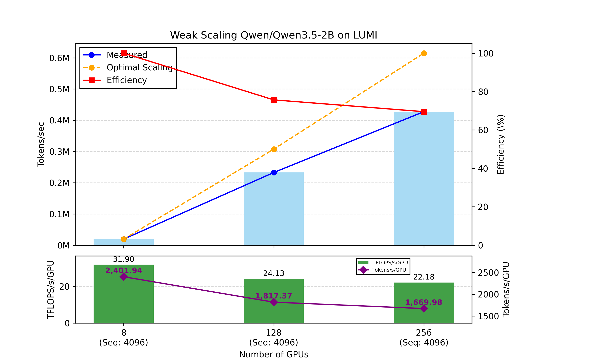
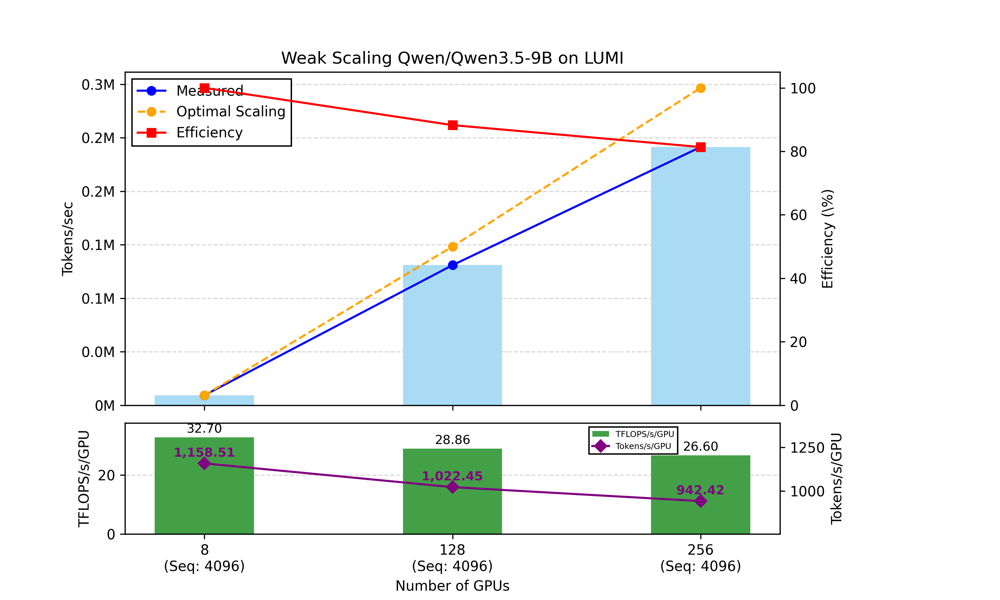

# Usage Guide for LUMI

## Preparing Datasets
Dataset preparation follows the exact same procedure as described in the [USAGE.md](USAGE.md) file. Please refer to that document for formatting and preprocessing instructions.

## Downloading Model Weights
Model weight downloading follows the exact same procedure as described in the [USAGE.md](USAGE.md) file. Ensure all weights are properly staged before launching jobs.

## Launch the Scripts

> **Note:** The examples below use a single node on the `dev-g` partition. For multinode training, simply change the `--nodes` parameter to your desired count. To change the partition, simply change the `--partition` to `standard-g`.

To launch the scripts using `sbatch`, run the corresponding command for your model version:

### Qwen3-VL-2B-Instruct
```bash
#!/bin/bash
sbatch --nodes 1 --partition dev-g scripts/lumi.sh configs/lumi/qwen3_2b.toml
```

### Qwen3-VL-8B-Instruct
```bash
#!/bin/bash
sbatch --nodes 1 --partition dev-g scripts/lumi.sh configs/lumi/qwen3_8b.toml
```
### Qwen/Qwen3.5-2B
```bash
#!/bin/bash
sbatch --nodes 1 --partition dev-g scripts/lumi.sh configs/lumi/qwen3_5_2b.toml
```
### Qwen/Qwen3.5-9B
```bash
#!/bin/bash
sbatch --nodes 1 --partition dev-g scripts/lumi.sh configs/lumi/qwen3_5_9b.toml
```
## Scaling plots
The scaling experiments are done with 1 node (8 GPUs), 16 (128 GPUs) nodes and 64 (256 GPUs) nodes on LUMI.
## Qwen3VL-2b

## Qwen3VL-8b

## Qwen3.5-2b

## Qwen3.5-9b
